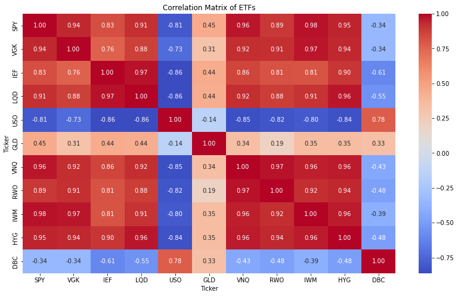
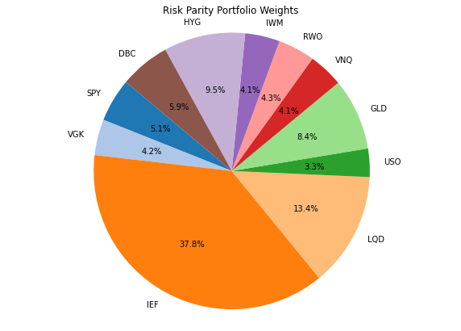

# Portfolio_Optimization
 Exploring different portfolio optimization methods on a control set of securities
 
 ## Table of Contents

1. [Dataset](#dataset)
2. [Exploratory Data Analysis](#exploratory-data-analysis)
3. [Risk Parity](#risk-parity)
4. [Mean-Variance (Markowitz)](#mean-variance-(markowitz))
5. [Genetic Algorithms](#genetic-algorithms)
6. [Monte Carlo Simulation](#monte-carlo-simulation)
7. [Sharpe Max Ratio](#sharpe-max-ratio)
8. [Future Work](#future-work)

## Dataset
In forming the list of control securties I wanted to ensure we diversify across asset classes such as stocks, bond, commodoties, real estate, etc. The simplest way to do so was to use ETFs such as SPY, which can represent asset classes. 

The is daily adjusted closing prices for the securities below. It is collected from yahoo finance using the Python package 'yfinance' and ranges from 2010-01-01 to 2023-01-01.
### Securities
Large-Cap US Equity: SPDR S&P 500 ETF (SPY) 
US Treasury Bonds: iShares 7-10 Year Treasury Bond ETF (IEF) 
Corporate Bonds: iShares iBoxx $ Investment Grade Corporate Bond ETF (LQD) 
Oil: United States Oil Fund (USO) 
Gold: SPDR Gold Shares (GLD) 
US Real Estate: Vanguard Real Estate ETF (VNQ) 
Global Real Estate: SPDR Dow Jones Global Real Estate ETF (RWO) 
Small-Cap Stocks: iShares Russell 2000 ETF (IWM) 
High Yield Bonds: iShares iBoxx $ High Yield Corporate Bond ETF (HYG) 
Broad Commodities: Invesco DB Commodity Index Tracking Fund (DBC) 
European Markets: Vanguard FTSE Europe ETF (VGK) 

## Exploratory Data Analysis
Before diving into the optimization methods I wanted to do some high level EDA on our Data 

In the correlation chart below we see how our securities relate to eachother 
The main observation here is that most of the securities have a positive correlation, except commodoties like USO, GLD, and DBC. 
Introducing such securities to the portfolio is theoretically good for the overall risk profile. 

We can also plot the prices of each security over the time frame to give insights into the risk and return profiles of them individually. For example below we see that SPY offers high returns in the period but is more volatile (relativley): 

Normalzing the prices improves chart readability:

## Risk Parity 
The theory behind Risk Parity Optimization is to purchase securites such that each one contributes an equal amount of risk to the portfolio. This can be achieved generally by purchasing less of the more risky securities and vice versa. Or mathematically:

Where 

 

So with that, we impliment the simple algorithm in python, using scipy.minimize to minimize the difference in risk contribtution from each asset. 

We find the following results: 
Annualized Expected Portfolio Return: 4.57% 
Annualized Portfolio Risk (Volatility): 6.87% \
This is an underwhelming result, but it is not suprising as we have some low volatility, low return securities in the portfolio which we would expect to get a lot of the capital distribution from this method. 

Indeed we see below that over 50% of capital is in Government and Corporate Bonds, as they have low risk profiles.
The problem with this is that we don't expose ourselves to enough potential returns (in my opinion) 

Below are the cummulative returns of all the securities and the risk parity porfolio. I takeaway that this is a good strategy for someone who is quite risk averse, but still wants the benefits of diversification, rather than just buying, say, U.S. Treasuries. 

I also think this would be an interesting method to apply to just the stock market, that way you could see some higher returns. For example instead of using the standard S&P 500 Index Fund, you could weight stocks according to risk parity.  

## Mean-Variance (Markowitz)

## Genetic Algorithms

## Monte Carlo Simulation

## Sharpe Max Ratio

## Future Work
