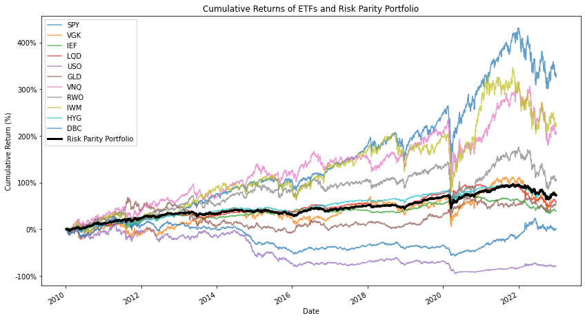

# Portfolio_Optimization
 Exploring different portfolio optimization methods on a control set of securities
 
 ## Table of Contents

1. [Dataset](#dataset)
2. [Exploratory Data Analysis](#exploratory-data-analysis)
3. [Risk Parity](#risk-parity)
4. [Mean-Variance](#mean-variance)
5. [Genetic Algorithms](#genetic-algorithms)
6. [Monte Carlo Simulation](#monte-carlo-simulation)
7. [Future Work](#future-work)

## Dataset
In forming the list of control securties I wanted to ensure we diversify across asset classes such as stocks, bond, commodoties, real estate, etc. The simplest way to do so was to use ETFs such as SPY, which can represent asset classes. 

The is daily adjusted closing prices for the securities below. It is collected from yahoo finance using the Python package 'yfinance' and ranges from 2010-01-01 to 2023-01-01.
### Securities
Large-Cap US Equity: SPDR S&P 500 ETF (SPY) 
US Treasury Bonds: iShares 7-10 Year Treasury Bond ETF (IEF) 
Corporate Bonds: iShares iBoxx $ Investment Grade Corporate Bond ETF (LQD) 
Oil: United States Oil Fund (USO) 
Gold: SPDR Gold Shares (GLD) 
US Real Estate: Vanguard Real Estate ETF (VNQ) 
Global Real Estate: SPDR Dow Jones Global Real Estate ETF (RWO) 
Small-Cap Stocks: iShares Russell 2000 ETF (IWM) 
High Yield Bonds: iShares iBoxx $ High Yield Corporate Bond ETF (HYG) 
Broad Commodities: Invesco DB Commodity Index Tracking Fund (DBC) 
European Markets: Vanguard FTSE Europe ETF (VGK) 

## Exploratory Data Analysis
Before diving into the optimization methods I wanted to do some high level EDA on our Data 

In the correlation chart below we see how our securities relate to eachother 
The main observation here is that most of the securities have a positive correlation, except commodoties like USO, GLD, and DBC. 
Introducing such securities to the portfolio is theoretically good for the overall risk profile. 

We can also plot the prices of each security over the time frame to give insights into the risk and return profiles of them individually. For example below we see that SPY offers high returns in the period but is more volatile (relativley): 

Normalzing the prices improves chart readability:

## Risk Parity 
The theory behind Risk Parity Optimization is to purchase securites such that each one contributes an equal amount of risk to the portfolio. This can be achieved generally by purchasing less of the more risky securities and vice versa. Or mathematically:

Where 

 

So with that, we impliment the simple algorithm in python, using scipy.minimize to minimize the difference in risk contribtution from each asset. 

We find the following results: 
Annualized Expected Portfolio Return: 4.57% 
Annualized Portfolio Risk (Volatility): 6.87% \
This is an underwhelming result, but it is not suprising as we have some low volatility, low return securities in the portfolio which we would expect to get a lot of the capital distribution from this method. 

Indeed we see below that over 50% of capital is in Government and Corporate Bonds, as they have low risk profiles.
The problem with this is that we don't expose ourselves to enough potential returns (in my opinion) 

Below are the cummulative returns of all the securities and the risk parity porfolio. I takeaway that this is a good strategy for someone who is quite risk averse, but still wants the benefits of diversification, rather than just buying, say, U.S. Treasuries. 

I also think this would be an interesting method to apply to just the stock market, that way you could see some higher returns. For example instead of using the standard S&P 500 Index Fund, you could weight stocks according to risk parity.  

## Mean-Variance
My reference for this method: [View Mean-Variance CAPM PDF](https://www.columbia.edu/~mh2078/FoundationsFE/MeanVariance-CAPM.pdf)

In reading about Markowitz's mean-variance method and the CAPM model, I was able to gain the most intuition from the mathematical formulas and graphs, so I'll lean on those here. 

Also note that I don't consider our list of securities to contain a risk-free asset. 
We assume the we have n risky assets which make up the return vector 𝑅  
We also assume that 𝑅 follows a Multivariate Normal distribution with mean vector 𝜇 covariance matrix 𝛴.

The mean-variance portfolio optimization problem is formulated as:

 
(Taken from above lecture notes) 

In english, this lays out the optmization problem as trying to find the weights (w) that produce the minimum risk (portfolio variance), given a target return (p) 
We also set constraints in implemtation: The sum of the weights is equal to 1 (all capital is invested) and each weight ∈ [0,1] (no options or leveraging) 

Given this, upon implimentation we can give the algorithm a target return rate and output the portfolio with the lowest risk. 
Using this, I derive both the portfolio with the highest Sharpe ratio, and the efficient portfolios frontier for our assets. 

In the below table are data for various porfolios across the efficient frontier. Note that securities not listed are weighted at 0. 
| Portfolio             | ETF  | Weight (%) | Return | Volatility |
|-----------------------|------|------------|--------|------------|
| Highest Sharpe Ratio  | SPY  | 32.15      | 0.06   | 0.06       |
|                       | IEF  | 66.26      |        |            |
|                       | GLD  | 1.59       |        |            |
| Portfolio 50          | IEF  | 22.69      | -0.03  | 0.28       |
|                       | USO  | 77.31      |        |            |
| Portfolio 150         | IEF  | 69.00      | 0.00   | 0.11       |
|                       | USO  | 31.00      |        |            |
| Portfolio 250         | SPY  | 7.95       | 0.04   | 0.05       |
|                       | IEF  | 66.52      |        |            |
|                       | HYG  | 21.45      |        |            |
|                       | DBC  | 4.08       |        |            |
| Portfolio 350         | SPY  | 46.54      | 0.07   | 0.08       |
|                       | IEF  | 50.94      |        |            |
|                       | GLD  | 2.52       |        |            |
| Portfolio 450         | SPY  | 81.41      | 0.11   | 0.15       |
|                       | IEF  | 13.58      |        |            |
|                       | GLD  | 5.01       |        |            |
| Portfolio 500         | SPY  | 100.00     | 0.13   | 0.18       |

My take away from this is that the mean variance algorithm is more flexible for investors than risk parity (above). 
We see that higher return portfolios are weighted in favor of riskier assets, with the most extreme example being all capital invested in SPY, which had the highest mean returns of all securities at hand. 
So, even though the max Sharpe ratio may suggest the investor to be less risky, there are alternative suggestions for someone looking for more return.  

The efficient portfolio frontier shows the entire spectrum of efficient portfolios, it follows that with higher returns come higher risk 
Finally, I draw a line at the minimum risk, as all portfolios below it would not be invested in by a rational person (they can gain higher returns for the same risk). 

## Genetic Algorithms

## Monte Carlo Simulation

## Future Work
